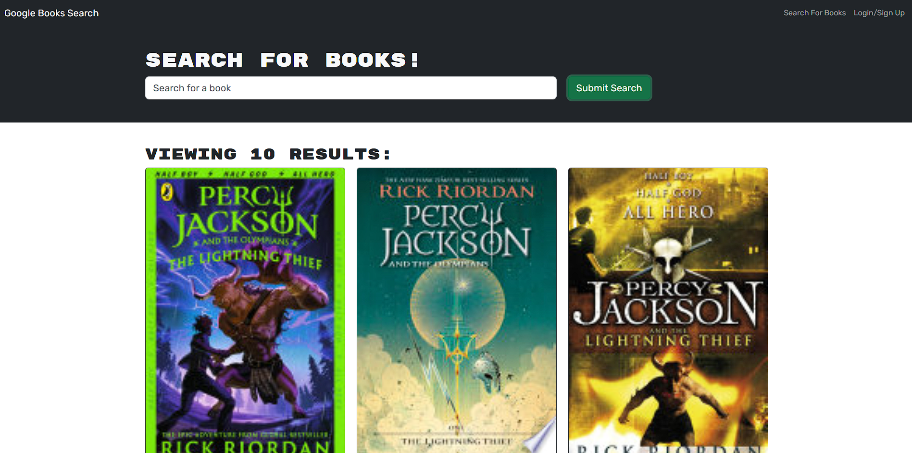
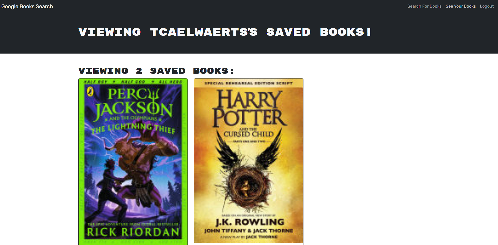

 # BookSearchEngine

  # Table of Contents
  1. [Description](#description)
  2. [Installation](#installation)
  3. [Usage](#usage)
  4. [Collaborators](#collaborators)
  5. [Features](#features)
  6. [Contact](#contact)
  

  ## Description
A way to view your books through Googles API and save them for later viewing

## Installation 
No worries about installing, just go to the website [here](https://booksearchengine-6pfg.onrender.com/)!

## Usage
You can search for books, but if you want to save them, click in the top right to sign up (or log in if you already have) and then you can save them as you go! Then when you want to view those saved books click on See Your Books.

## Collaborators 
With the assistance of previous cohorts, our recordings, classmates and coPilot.

## Features
Login/Sign up, Search, and Save your books for later

## Contact
GitHub: [tiecaelwaerts](https://github.com/tiecaelwaerts)
Email: tiecaelwaerts@gmail.com
